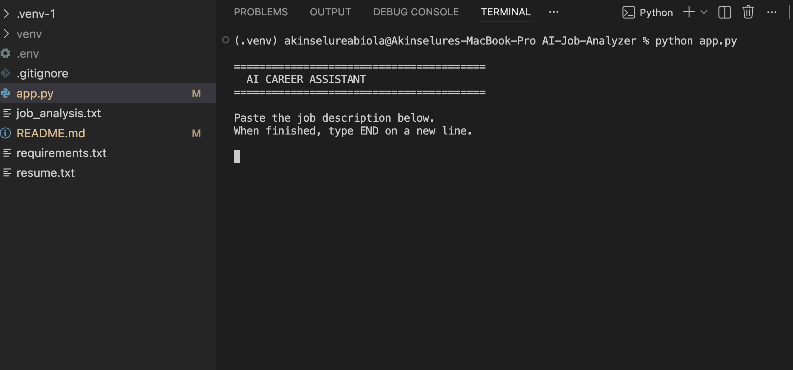
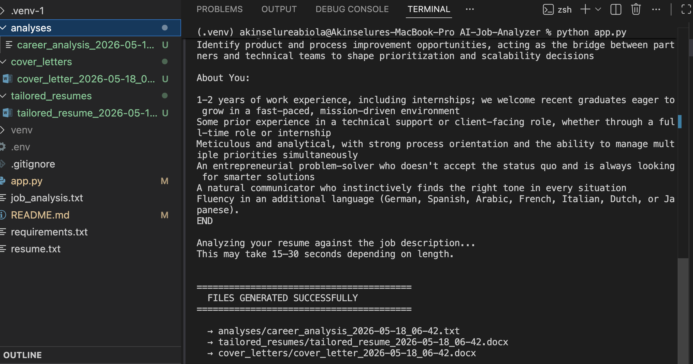

<<<<<<< HEAD
# AI Career Assistant

AI Career Assistant is a Python-based automation project that analyzes a resume against a job description using the OpenAI API.

The goal of the project is to help improve resumes for ATS (Applicant Tracking Systems) while also generating more tailored application materials such as:
- Resume improvement suggestions
- ATS keyword optimization
- Tailored resume summaries
- Customized cover letters
- Interview preparation topics
- Realistic career fit analysis

The project was built as a practical learning project while improving skills in:
- Python scripting
- API integration
- Automation workflows
- Prompt engineering
- File handling
- DOCX generation

---

# Features

## Resume Analysis
The tool compares a candidate's resume against a pasted job description and provides:
- Realistic resume match scoring
- Strengths and transferable skills
- ATS keyword suggestions
- Missing skill analysis
- Recruiter concern analysis

## Tailored Resume Suggestions
The application rewrites sections of the resume to better align with the target role while keeping the content realistic and truthful.

## Cover Letter Generation
The project generates a tailored cover letter based on:
- The resume
- The target job description
- Transferable technical skills
- ATS optimization principles

## Career Guidance
The tool also gives realistic advice on:
- Whether the candidate should apply
- Skill gaps
- Areas to improve before applying

## DOCX Export
Generated resumes and cover letters are automatically exported as Microsoft Word documents.

---

# Technologies Used

- Python
- OpenAI API (GPT-4.1-mini)
- python-docx
- python-dotenv

---

# Project Structure

```bash
AI-Career-Assistant/
│
├── app.py
├── resume.txt
├── .env
│
├── analyses/
│   └── career analysis output files
│
├── tailored_resumes/
│   └── generated resume documents
│
├── cover_letters/
│   └── generated cover letter documents
=======
# AI Hub Platform

## Overview

AI Hub Platform is a modular AI platform that brings together multiple AI-powered applications into a single workspace.

Instead of building standalone AI tools that solve one problem at a time, the goal of this project is to create a central platform where users can access different AI assistants from one dashboard. Each assistant is designed to solve practical business and IT problems while sharing the same authentication, infrastructure, and backend services.

This project is being built incrementally, with each module representing a real-world use case and an opportunity to explore modern software engineering practices, cloud infrastructure, and AI integration.

---

## Why I Started This Project

Over the last couple of years, I've built several independent AI applications, including an ATS Resume Assistant and an AI IT Support Copilot. As those projects grew, I realised maintaining separate applications wasn't scalable.

Rather than continuing to build isolated tools, I decided to create a single platform where multiple AI applications can live under one architecture while sharing authentication, database services, and a consistent user experience.

The project is also helping me strengthen my understanding of modern web development, cloud technologies, software architecture, and enterprise application design.

---

## Current Features

Current progress includes:

* Modern Next.js application structure
* Supabase integration
* Backend architecture
* Shared authentication foundation
* Centralised project structure
* Documentation and system design
* Responsive landing page
* Vercel deployment

---

## Planned AI Modules

The platform is designed to support multiple AI applications, including:

### ATS Resume Assistant

* ATS resume analysis
* Resume tailoring
* Cover letter generation
* Job description matching
* DOCX export

### AI IT Support Copilot

* Incident classification
* Guided troubleshooting
* Root Cause Analysis
* Ticket escalation recommendations
* Knowledge base integration

### Software Testing Assistant

* AI-generated Pytest test cases
* Test coverage suggestions
* Unit testing assistance
* Mock generation
* Testing documentation

Additional AI modules will be added as the platform evolves.

---

## Technology Stack

### Frontend

* Next.js
* React
* TypeScript
* Tailwind CSS

### Backend

* Supabase
* PostgreSQL
* Server Actions
* Authentication Middleware

### AI

* OpenAI
* LangGraph
* Python

### Deployment

* Vercel
* Cloudflare
* GitHub

---

## Project Structure

```text
AI-Hub-Platform/

app/
components/
lib/
public/
docs/

README.md
package.json
>>>>>>> f860b7020aa86cd16d2c76289c1d904098cd8c17
```

---

<<<<<<< HEAD
# Setup & Usage

### 1. Clone the repository
```bash
git clone https://github.com/akinselureabiola/ATS-Resume-Assistant.git
cd ATS-Resume-Assistant
```

### 2. Install dependencies
```bash
pip install openai python-docx python-dotenv
```

### 3. Add your OpenAI API key
Create a `.env` file in the root folder and add:
OPENAI_API_KEY=your-api-key-here

### 4. Add your resume
Create a `resume.txt` file in the root folder and paste your resume content into it.

### 5. Run the tool
```bash
python app.py
```

When prompted, paste the job description and type `END` on a new line when finished.

### 6. Check your outputs
Generated files are saved automatically to:
- `analyses/` — career fit analysis (.txt)
- `tailored_resumes/` — tailored resume suggestions (.docx)
- `cover_letters/` — tailored cover letter (.docx)

---

# Sample Output

## Screenshots

### Tool Running


### Files Generated Successfully


---

# Notes

- This tool is designed to assist job seekers in understanding their resume fit before applying
- All generated content is based on the candidate's real experience — nothing is invented
- Best used as a guide alongside your own judgment, not as a replacement for it

=======
## Documentation

Project documentation is available in the **docs** folder.

Current documentation includes:

* Software Architecture & Technical Design Document (SATDD)
* High-Level Architecture
* User Flow Diagram

More technical documentation will be added as development progresses.

---

## Development Roadmap

### Phase 1

* Project setup
* Infrastructure
* Supabase integration
* Deployment
* Documentation

### Phase 2

* User authentication
* Protected routes
* Dashboard

### Phase 3

* ATS Resume Assistant integration

### Phase 4

* AI IT Support Copilot integration

### Phase 5

* Software Testing Assistant

### Phase 6

* Analytics
* User management
* Platform administration

---

## What I'm Learning

This project is helping me gain hands-on experience with:

* Software architecture
* Authentication
* Cloud infrastructure
* API integration
* AI application development
* Full-stack development
* Software documentation
* Modern Git workflows
* System design

---

## Current Status

The project is actively under development.

New features and improvements are added incrementally as the platform evolves.

---

## Author

**Abiola Akinselure**

IT Support Engineer | AI Automation | Systems Administration | Cloud & Infrastructure

GitHub:
https://github.com/akinselureabiola

LinkedIn:
https://www.linkedin.com/in/abiola-desmond-akinselure-599134241/

---

## Acknowledgements

This project has benefited from technical discussions and architectural guidance from an experienced software engineering mentor. Those conversations have helped me strengthen my understanding of software architecture, cloud infrastructure, and scalable application design.

The implementation, documentation, and ongoing development of the platform continue to be part of my learning journey as I build and expand the project.
>>>>>>> f860b7020aa86cd16d2c76289c1d904098cd8c17
